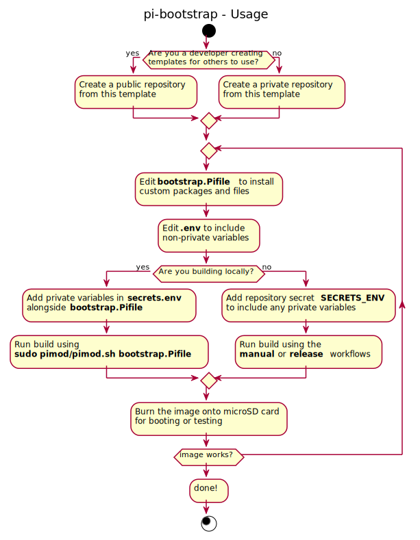

# pi-bootstrap

A repository that shows how to use [Pimod](https://github.com/Nature40/pimod.git) and Github Actions to create a ready-to-use Raspberry Pi image that includes connectivity to your home Wi-Fi, custom packages and build steps without opening a terminal or any manual setup. You can do all of this directly within the Github UI, which significantly lowers the barrier of entry for novice users, who don't need to understand a lot of the technical details.

Youtube video explaining the what, why and how.

[](http://www.youtube.com/watch?v=Lc6wvHgMYH4 "Bootstrapping the Raspberry Pi using GitHub Actions ")

:gear: This repository is intended as a basic template for developers who wish to create ready-to-use bootstrap repositories meant for novice users. See [aniongithub/rhasspy-appliance](https://github.com/aniongithub/rhasspy-appliance) for an example of a repository meant for novice end-users to use directly

## Module environment variables

The table below lists variables for each module in pi-bootstrap, confidential variables are marked by 🔑 and should be set in Github repository secret ```SECRET_ENV``` (or ```secrets.env``` if developing locally) while others can be committed to git in ```.env```


|     Module     | Variable                        | Description                                                                                                                     | Default               |
| :--------------: | --------------------------------- | --------------------------------------------------------------------------------------------------------------------------------- | ----------------------- |
|   ```core```   |                                 | Sets up core functions, software, environment, etc. Required to use pi-bootstrap modules                                        |                       |
| ```hostname``` |                                 | Changes the hostname of your Raspberry Pi                                                                                       |                       |
|               | **BOOTSTRAP_HOSTNAME**          | The name with which your Pi will identify itself to any networks                                                                | *pi-bootstrap*        |
|   ```ssh```   |                                 | Enables SSH access                                                                                                              |                       |
| ```password``` |                                 | Changes the password for a specified user for more security                                                                     |                       |
|               | **BOOTSTRAP_USER** 🔑           | Name of the user to change the password for                                                                                     | *pi*                  |
|               | **BOOTSTRAP_PASSWORD** 🔑       | The password for**${BOOTSTRAP_USER}** on the generated image                                                                    | *b00tstrap*           |
| ```timezone``` |                                 | Sets the timezone of your Raspberry Pi                                                                                          |                       |
|               | **BOOTSTRAP_TIMEZONE**          | The[TZ database name](https://en.wikipedia.org/wiki/List_of_tz_database_time_zones) (timezone) where your Raspberry Pi will run | *America/Los_Angeles* |
|  ```camera```  |                                 | Enables the Raspberry Pi camera module                                                                                          |                       |
|               | **BOOTSTRAP_GPU_MEM**           | Amount of GPU memory (MB) to reserve for camera operation                                                                       | 128                   |
|   ```wifi```   |                                 |                                                                                                                                 |                       |
|               | **BOOTSTRAP_WPA_SSID** 🔑       | SSID of your Wi-Fi network                                                                                                      | *None*                |
|               | **BOOTSTRAP_WPA_PASSPHRASE** 🔑 | Passphrase of your Wi-Fi network                                                                                                | *None*                |
|               | **BOOTSTRAP_WPA_COUNTRY**       | Two-character ISO-3166-1 alpha-2 country code](https://en.wikipedia.org/wiki/ISO_3166-1_alpha-2) for your country.              | *None*                |
|  ```docker```  |                                 | Sets up docker and docker-compose                                                                                               |                       |

## Usage

The flowchart below shows simple usage of pi-bootstrap.

